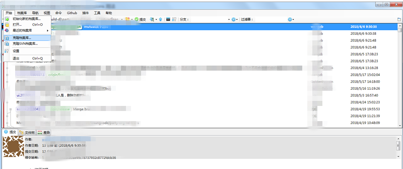
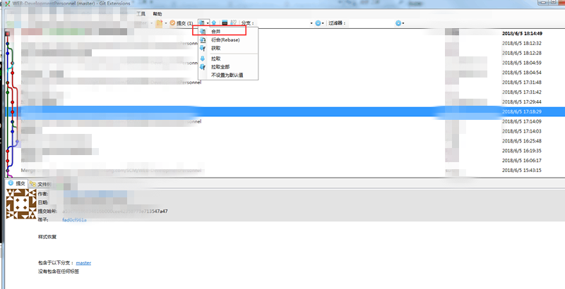
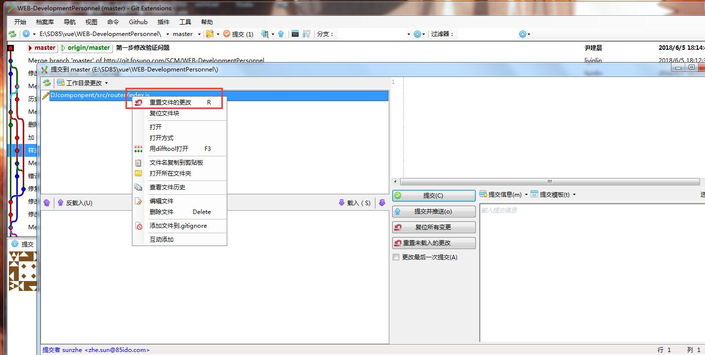
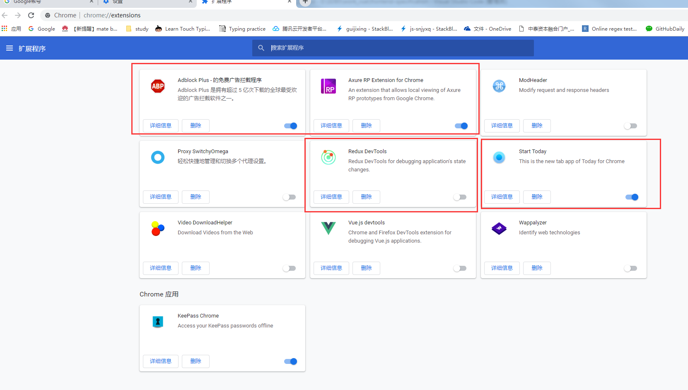

### **文件编辑器 [Notepad++](./file/tools/download/npp.7.6.4.Installer.x64.exe)**
#### 理由：可缓存临时文件
 
#### 插件配置

  
> JSON Viewer

  
  


### **文件查找工具 [Listary](./file/tools/download/Listary_5.0.2843.0.exe)**
#### 激活

#### 查询，enter打开选中，ctrl+enter打开选中上级文件夹，项目或程序选择路径时可ctrl+G定位到打开的资源管理器地址

#### Web查询，输入关键字，然后空格或tab，输入查询内容，回车查询


#### 配置Web查询关键字

> 批量添加关键字
```
google|Search Google for '{query}'|http://www.google.com/search?q={query}
baidu|Search Baidu for '{query}'|http://www.google.com/search?q={query}
bing|Search Bing for '{query}'|http://www.bing.com/search?q={query}
fanyi|百度翻译zh-en|https://fanyi.baidu.com/#zh/en/{query}
translate|谷歌翻译en-zh|https://translate.google.cn/?source=osdd#view=home&op=translate&sl=en&tl=zh-CN&text={query}
zhihu|Search zhihu for '{query}'|http://www.zhihu.com/search?q={query}
github|Search github for '{query}'|https://github.com/search?q={query}&ref=opensearch
antd|ant.design|https://ant.design/components/%s-cn/
iview|iView|https://www.iviewui.com/docs/guide/%s
lodash|lodash|https://www.lodashjs.com/docs/#%s
mozilla|Mozilla 开发者网络|https://developer.mozilla.org/zh-CN/search?q=%s&w=3&qs=plugin
ramda|ramda|https://ramdajs.com/docs/#%s
```
### **剪贴板增强工具 [Ditto](./file/tools/download/Ditto_64_3.22.20.0.exe)**
#### 激活

#### 查找历史复制剪切内容,选择粘贴

### **Git管理工具 [GitExtensions](./file/tools/download/GitExtensions-3.0.2.5232.exe) &代码合并工具     [KDiff3](./file/tools/download/KDiff3-64bit-Setup_0.9.98-2.exe)**
#### 配置环境

#### 克隆项目


#### 打开已下载的项目，最近列表直接点击

#### 最近列表没有直接打开 Ctrl+O

#### 拉取最新代码

#### 代码提交并推送 (有改动时先提交推送后拉取。没改动先拉取再修改)

#### 推送合并

#### 重置 (代码不想改了恢复到未改动之前，重置)

#### 分支切换 (建议都提交后再切换分支)


#### 冲突合并
>pull 代码时合并代码，出现冲突


>解决冲突，打开kdiff3


>通过上下箭头查看A/B/C 全都未选择的冲突代码手动选择
```
A 本地修改版本
B 基础版本
C 远程版本
```

>默认打开文件格式System,需在settings 修改为utf8

### **前端开发IDE [VSCode](./file/tools/download/VSCodeUserSetup-x64-1.30.1.exe)**
#### 配置插件
>1、添加sync


>2、同步配置

>>(1) F1,点击下载配置


>>(2) 输入Token f6f396f65d459ef8194824647774cc3136dc89c4


>>(3) 输入Gist Id c1e755a3d24da9a2709c44b4a3a54609


>>(4) Extensions 下载完毕


>3、重置配置
>>(1) 如果需要自己配置环境，可以F1,Sync 重置，然后Sync如何配置 创建自己的个性化配置


>4、检查配置
>>(1) 检查git bash 地址是否正确


#### 快捷键常用
```
F1 命令
ctrl+P 通过文件名快速查询
ctrl+shift+` 打开终端面板
ctrl+J 切换面板
ctrl+B 切换侧边栏
ctrl+0 聚焦到侧边栏
ctrl+1 聚焦到第一个编辑器
ctrl+2 聚焦到终端
ctrl+shift+E 显示侧边资源管理器
shift+alt+R 打开资源管理器（当光标选中文件时）
ctrl+shift+F 在文件中搜素
ctrl+shift+T 重新打开关闭编辑器
ctrl+D 下一个编辑匹配项
ctrl+shift+L 全选编辑匹配项 
ctrl+U 上一个光标处/撤回上一个编辑匹配项
ctrl+shift+down 向下复制行
alt+down 向下移动行
```
### **调试浏览器 [chrome](./file/tools/download/ChromeSetup.exe)**
#### 配置
>1、登录，打开数据同步


>2、添加常用扩展


>3、添加搜索引擎,同 [Listary Web查询](#Web查询输入关键字然后空格或tab输入查询内容回车查询) 方式相同

 


#### 快捷键常用
```
ctrl+N 打开新窗口
ctrl+shift+N 打开无痕窗口
ctrl+T 打开新标签
ctrl+W 关闭当前标签
ctrl+shift+T 重新打开关闭的标签
alt+D 选中地址栏
alt+enter 复制选中地址栏地址到新标签
ctrl+tab 下一个标签
ctrl+shift+tab 上一个标签 
ctrl+1 第一个标签
ctrl+8 第八个标签
ctrl+9 最后一个标签
ctrl+0 缩放100% 
```
